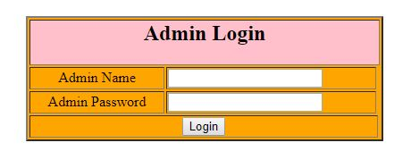
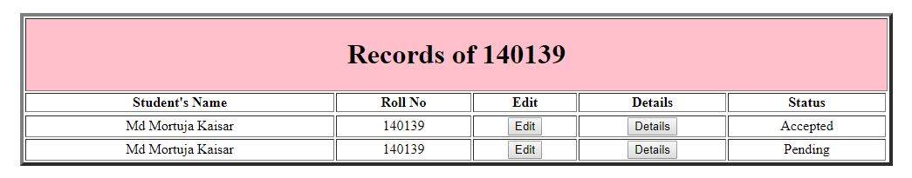
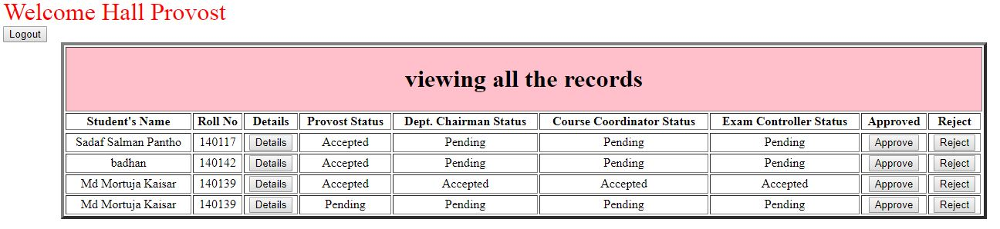
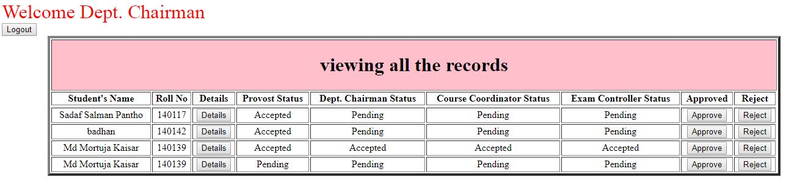
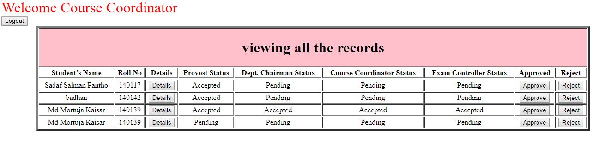
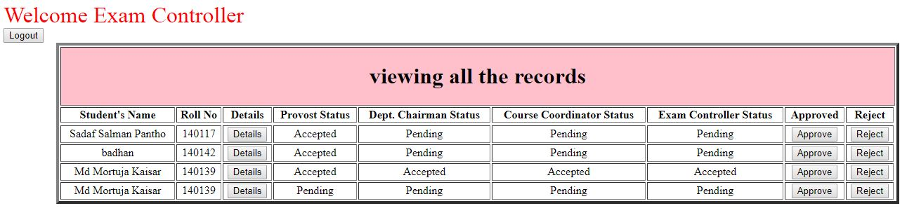
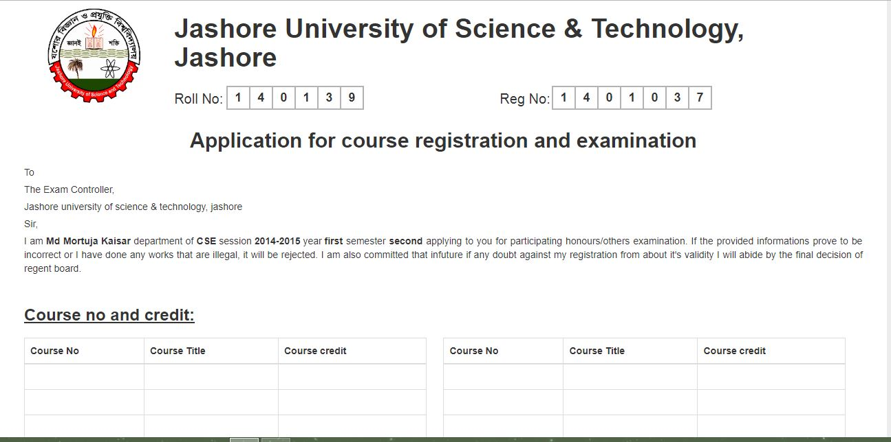

# <h2>Online Course Registration For Jashore University of Science and Technology.<h2>

# 
Admin Login Page

# 
View of student record.Here student's can update their information,can see their details information and check their status where as their registration is Accepted or Rejected.

  

# 
Hall Provost Approval Page.Here provost can see their student's details information.If all are okay then provost accepted their status otherwise rejected their status.

  
  
# 
Departmental Chairman Approval Page.Here Chairman can see their student's details information.If all are okay then Chairman accepted their status otherwise rejected their status.

  
  
# 
Course Coordinator Approval Page.Here Coordinator can see their student's details information.If all are okay then Coordinator accepted their status otherwise rejected their status.

  
  
# 
Exam. Controller Approval Page.Here Exam Cotroller can see their student's details information.If all are okay then Exam Controller accepted their status otherwise rejected their status.

  
  
# 
Registration Form With Details Information Of A Student

  